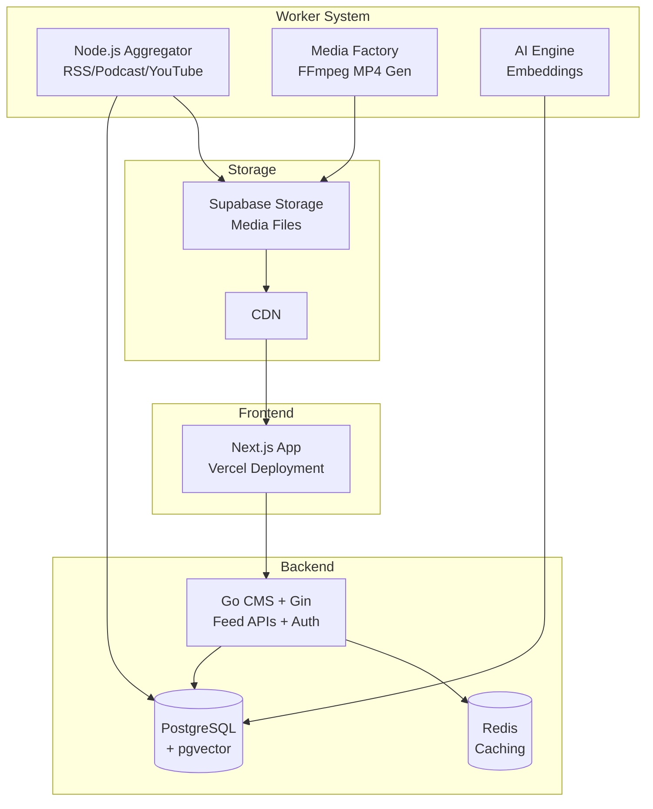
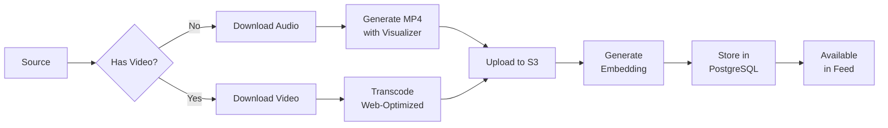

# Lumen Platform - Complete Context & Requirements

> **Purpose:** This document provides all context and requirements needed to understand, build, and extend the Lumen Platform. Use this for onboarding new developers, LLM agents, or external teams.

---

## Table of Contents

1. [Executive Summary](#executive-summary)
2. [Product Vision](#product-vision)
3. [System Architecture](#system-architecture)
4. [Technology Stack](#technology-stack)
5. [Frontend (Lumen Web App)](#frontend-lumen-web-app)
6. [Backend (Go CMS)](#backend-go-cms)
7. [Content Aggregator (Node.js)](#content-aggregator-nodejs)
8. [Database Schema](#database-schema)
9. [API Contracts](#api-contracts)
10. [Content Pipeline](#content-pipeline)
11. [AI & Embeddings](#ai--embeddings)
12. [Current Implementation Status](#current-implementation-status)
13. [Development Setup](#development-setup)

---

## Executive Summary

**Lumen** is a mobile-first social platform featuring dual-mode discovery:

| Feed | Description | Content |
|------|-------------|---------|
| **For You** | TikTok-style vertical scrolling | Audio/video clips (podcasts, interviews) |
| **News** | Magazine-style slides | 1 Featured article + 3 Related items |

### Core Value Proposition

- **Consumers**: Discover podcasts and news without decision fatigue
- **Creators**: Viral discovery for audio content usually buried in podcast apps
- **Publishers**: Premium magazine-quality presentation for journalism

---

## Product Vision

### User Experience

```
┌─────────────────────────────────────────────────────┐
│                    LUMEN APP                        │
├─────────────────────────────────────────────────────┤
│                                                     │
│   [For You]  [News]                                │
│                                                     │
│   ┌───────────────────────────────────┐            │
│   │                                   │            │
│   │     FULL-SCREEN CONTENT           │            │
│   │     (Snap Scroll)                 │            │
│   │                                   │            │
│   │   • For You: Video/Audio Cards    │            │
│   │   • News: Magazine Slides         │            │
│   │                                   │            │
│   └───────────────────────────────────┘            │
│                                                     │
│   [Home] [Discover] [+] [Saved] [Profile]          │
│                                                     │
└─────────────────────────────────────────────────────┘
```

### Interaction Model

| Action | Trigger |
|--------|---------|
| Like | Double-tap or heart button |
| Bookmark | Save button |
| Share | Native share or copy link |
| View | Tracked via Intersection Observer |
| Complete | Audio/video finished playing |

---

## System Architecture



---

## Technology Stack

| Component | Technology | Version |
|-----------|------------|---------|
| **Frontend** | Next.js (App Router) | 16.1.3 |
| **UI Components** | shadcn/ui + Radix | Latest |
| **State Management** | Zustand + TanStack Query | 5.x |
| **Animations** | Framer Motion | 12.x |
| **Backend** | Go + Gin | 1.24+ |
| **ORM** | GORM | Latest |
| **Database** | PostgreSQL + pgvector | 16+ |
| **Cache** | Redis | 7.x |
| **Aggregator** | Node.js | 20+ |
| **Job Queue** | BullMQ | Latest |
| **Media Processing** | FFmpeg | 6.x |
| **Embeddings** | all-MiniLM-L6-v2 | 384 dims |
| **Transcription** | Whisper (Groq API) | - |
| **Storage** | Supabase Storage | - |
| **Deployment** | Vercel (FE), Docker (BE) | - |

---

## Frontend (Lumen Web App)

### Directory Structure

```
lumen-platform/
├── src/
│   ├── app/
│   │   ├── (feeds)/
│   │   │   ├── layout.tsx       # Shared feed layout
│   │   │   ├── page.tsx         # For You feed (/)
│   │   │   └── news/page.tsx    # News feed (/news)
│   │   └── layout.tsx           # Root layout
│   ├── components/
│   │   ├── feed/                # Feed components
│   │   │   ├── feed-container.tsx
│   │   │   ├── for-you-card.tsx
│   │   │   ├── news-slide.tsx
│   │   │   ├── feed-skeleton.tsx
│   │   │   ├── pull-to-refresh.tsx
│   │   │   └── view-tracker.tsx
│   │   ├── layout/              # Layout components
│   │   │   ├── bottom-nav.tsx
│   │   │   └── feed-switcher.tsx
│   │   ├── ui/                  # shadcn/ui components
│   │   └── error-boundary.tsx
│   ├── lib/
│   │   ├── api/feeds.ts         # API client
│   │   ├── hooks/use-feed.ts    # TanStack Query hooks
│   │   ├── stores/feed-store.ts # Zustand store
│   │   └── utils.ts
│   └── types/
│       ├── feed.ts              # Feed types
│       └── index.ts
├── .env.example
├── .env.local
└── package.json
```

### Key Components

| Component | Purpose |
|-----------|---------|
| `FeedContainer` | Snap-scroll container with CSS scroll-snap |
| `ForYouCard` | Full-screen video/audio card with actions |
| `NewsSlide` | Magazine layout: 1 Featured + 3 Related |
| `FeedSwitcher` | Tab navigation between feeds |
| `ViewTracker` | Intersection Observer for analytics |
| `ErrorBoundary` | Error handling with retry |

### Environment Variables

```env
# Backend API URL (Go CMS)
NEXT_PUBLIC_API_URL=http://localhost:8080/api/v1

# Enable mock data mode (for development without backend)
NEXT_PUBLIC_USE_MOCK_DATA=true
```

---

## Backend (Go CMS)

### Required API Endpoints

| Method | Endpoint | Description |
|--------|----------|-------------|
| GET | `/api/v1/feed/foryou` | For You feed (paginated) |
| GET | `/api/v1/feed/news` | News feed slides (paginated) |
| GET | `/api/v1/content/:id` | Single content item |
| POST | `/api/v1/interactions` | Record user interaction |
| GET | `/api/v1/interactions/bookmarks` | User's bookmarks |
| DELETE | `/api/v1/interactions/:id` | Remove interaction |

### For You Feed Response

```json
{
  "cursor": "next-cursor-token",
  "items": [
    {
      "id": "uuid",
      "type": "VIDEO",
      "title": "The Future of AI",
      "media_url": "https://cdn.../podcast_clip.mp4",
      "thumbnail_url": "https://cdn.../thumb.jpg",
      "duration_sec": 120,
      "author": "Radio Thamanyah",
      "source_name": "Thamanyah Podcast",
      "like_count": 1234,
      "comment_count": 89,
      "share_count": 45,
      "published_at": "2026-01-18T10:00:00Z",
      "is_liked": false,
      "is_bookmarked": false
    }
  ]
}
```

### News Feed Response

```json
{
  "cursor": "next-cursor-token",
  "slides": [
    {
      "slide_id": "uuid",
      "featured": {
        "id": "uuid",
        "type": "ARTICLE",
        "title": "Tech Industry Shifts",
        "excerpt": "Major changes announced...",
        "thumbnail_url": "https://cdn.../image.jpg",
        "author": "Tech News",
        "published_at": "2026-01-18T10:00:00Z"
      },
      "related": [
        { "id": "uuid", "type": "TWEET", "body_text": "...", "author": "@user" },
        { "id": "uuid", "type": "COMMENT", "body_text": "...", "author": "Reader" },
        { "id": "uuid", "type": "ARTICLE", "title": "Analysis", "excerpt": "..." }
      ]
    }
  ]
}
```

---

## Content Aggregator (Node.js)

### Responsibilities

1. **Fetch Content** from RSS, Podcast feeds, YouTube
2. **Process Media** with FFmpeg (audio → MP4)
3. **Generate Embeddings** for semantic search
4. **Transcribe Audio** using Whisper
5. **Store Results** in PostgreSQL + S3

### Content Sources (MVP)

| Source | Priority | Method |
|--------|----------|--------|
| RSS News Feeds | High | `rss-parser` library |
| Podcast RSS | High | iTunes search + RSS |
| Radio Thamanyah | High | Direct RSS integration |
| YouTube | Medium | YouTube Data API v3 |
| Manual Upload | Medium | CMS admin interface |

### FFmpeg Commands

```bash
# Audio to MP4 with waveform visualization
ffmpeg -i input.mp3 \
  -filter_complex "[0:a]showwaves=s=1080x1920:mode=cline:colors=white[v]" \
  -map "[v]" -map 0:a \
  -c:v libx264 -preset fast -crf 23 \
  -c:a aac -b:a 128k \
  output.mp4

# Optimize video for web
ffmpeg -i input.mp4 \
  -c:v libx264 -preset fast -crf 23 \
  -c:a aac -b:a 128k \
  -movflags +faststart \
  -vf "scale=1080:1920:force_original_aspect_ratio=decrease,pad=1080:1920:(ow-iw)/2:(oh-ih)/2" \
  output.mp4
```

---

## Database Schema

### content_items Table

```sql
CREATE EXTENSION IF NOT EXISTS vector;

CREATE TYPE content_type AS ENUM ('ARTICLE', 'VIDEO', 'TWEET', 'COMMENT', 'PODCAST');
CREATE TYPE source_type AS ENUM ('RSS', 'PODCAST', 'YOUTUBE', 'UPLOAD', 'MANUAL');
CREATE TYPE content_status AS ENUM ('PENDING', 'PROCESSING', 'READY', 'FAILED', 'ARCHIVED');

CREATE TABLE content_items (
    id UUID PRIMARY KEY DEFAULT gen_random_uuid(),
    
    -- Classification
    type content_type NOT NULL,
    source source_type NOT NULL,
    status content_status DEFAULT 'PENDING',
    
    -- Content
    title TEXT,
    body_text TEXT,
    excerpt TEXT,
    
    -- Media
    media_url TEXT,
    thumbnail_url TEXT,
    original_url TEXT,
    duration_sec INTEGER,
    transcript_id UUID,
    
    -- AI & Ranking
    embedding vector(384),
    topic_tags TEXT[],
    
    -- Metadata
    author TEXT,
    source_name TEXT,
    source_feed_url TEXT,
    metadata JSONB,
    
    -- Engagement
    like_count INTEGER DEFAULT 0,
    comment_count INTEGER DEFAULT 0,
    share_count INTEGER DEFAULT 0,
    view_count INTEGER DEFAULT 0,
    
    -- Timestamps
    published_at TIMESTAMP,
    created_at TIMESTAMP DEFAULT NOW(),
    updated_at TIMESTAMP DEFAULT NOW()
);

CREATE INDEX idx_content_type ON content_items(type);
CREATE INDEX idx_content_status ON content_items(status);
CREATE INDEX idx_content_published ON content_items(published_at DESC);
CREATE INDEX idx_content_embedding ON content_items USING ivfflat (embedding vector_cosine_ops);
```

### transcripts Table

```sql
CREATE TABLE transcripts (
    id UUID PRIMARY KEY DEFAULT gen_random_uuid(),
    content_item_id UUID REFERENCES content_items(id) ON DELETE CASCADE,
    full_text TEXT NOT NULL,
    summary TEXT,
    word_timestamps JSONB,
    language VARCHAR(10),
    created_at TIMESTAMP DEFAULT NOW()
);
```

### user_interactions Table

```sql
CREATE TABLE user_interactions (
    id UUID PRIMARY KEY DEFAULT gen_random_uuid(),
    user_id UUID,
    session_id VARCHAR(255),
    content_item_id UUID REFERENCES content_items(id) ON DELETE CASCADE,
    interaction_type VARCHAR(50) NOT NULL,
    metadata JSONB,
    created_at TIMESTAMP DEFAULT NOW(),
    UNIQUE(user_id, content_item_id, interaction_type)
);
```

### content_sources Table

```sql
CREATE TABLE content_sources (
    id UUID PRIMARY KEY DEFAULT gen_random_uuid(),
    name VARCHAR(255) NOT NULL,
    type source_type NOT NULL,
    feed_url TEXT,
    api_config JSONB,
    is_active BOOLEAN DEFAULT true,
    fetch_interval_minutes INTEGER DEFAULT 60,
    last_fetched_at TIMESTAMP,
    metadata JSONB,
    created_at TIMESTAMP DEFAULT NOW()
);
```

---

## API Contracts

### TypeScript Types

```typescript
// Content Types
type ContentType = 'ARTICLE' | 'VIDEO' | 'TWEET' | 'COMMENT' | 'PODCAST';
type SourceType = 'RSS' | 'PODCAST' | 'YOUTUBE' | 'UPLOAD' | 'MANUAL';

interface ContentItem {
  id: string;
  type: ContentType;
  title?: string;
  body_text?: string;
  excerpt?: string;
  media_url?: string;
  thumbnail_url?: string;
  original_url?: string;
  duration_sec?: number;
  author?: string;
  source_name?: string;
  like_count: number;
  comment_count: number;
  share_count: number;
  published_at: string;
  created_at: string;
  is_liked?: boolean;
  is_bookmarked?: boolean;
}

interface NewsSlide {
  slide_id: string;
  featured: ContentItem;
  related: ContentItem[];
}

interface ForYouResponse {
  cursor: string | null;
  items: ContentItem[];
}

interface NewsResponse {
  cursor: string | null;
  slides: NewsSlide[];
}

interface Interaction {
  id: string;
  content_item_id: string;
  interaction_type: 'like' | 'bookmark' | 'share' | 'view' | 'complete';
  created_at: string;
}
```

---

## Content Pipeline



---

## AI & Embeddings

### Embedding Model

| Property | Value |
|----------|-------|
| Model | `all-MiniLM-L6-v2` |
| Dimensions | 384 |
| License | Apache 2.0 |
| Size | ~80MB |

### Vector Search Query

```sql
-- Find 30 most similar items for slide assembly
SELECT id, title, type, 
       1 - (embedding <=> $1) as similarity
FROM content_items
WHERE id != $2
  AND status = 'READY'
  AND type IN ('TWEET', 'COMMENT', 'ARTICLE')
ORDER BY embedding <=> $1
LIMIT 30;
```

### Ranking Factors

| Factor | Weight | Description |
|--------|--------|-------------|
| Freshness | 40% | Decay from published_at |
| Engagement | 25% | Likes + 2×Shares + 0.5×Comments |
| Semantic Match | 25% | Vector similarity |
| Diversity | 10% | Penalize same source/topic |

---

## Current Implementation Status

### ✅ Completed (Phase 1 Frontend)

- [x] Next.js 14+ with App Router
- [x] Core dependencies (shadcn/ui, TanStack Query, Zustand, Framer Motion)
- [x] Route structure with `(feeds)` group
- [x] For You feed with mock data
- [x] News feed with magazine layout
- [x] Feed components (FeedContainer, ForYouCard, NewsSlide)
- [x] Loading skeletons
- [x] Error boundary with retry
- [x] View tracking (Intersection Observer)
- [x] Infinite scroll support
- [x] API integration ready (env toggle)

### ❌ Not Started (Requires Backend)

- [ ] Go CMS feed endpoints
- [ ] PostgreSQL with pgvector
- [ ] Redis caching
- [ ] Node.js aggregator service
- [ ] FFmpeg media processing
- [ ] Whisper transcription
- [ ] Embedding generation
- [ ] Supabase Storage integration

---

## Development Setup

### Frontend

```bash
cd lumen-platform

# Install dependencies
npm install

# Run development server (with mock data)
npm run dev

# Build for production
npm run build
```

### Backend (Future)

```bash
# PostgreSQL with pgvector
docker run -d \
  --name lumen-db \
  -e POSTGRES_PASSWORD=password \
  -p 5432:5432 \
  ankane/pgvector

# Redis
docker run -d \
  --name lumen-redis \
  -p 6379:6379 \
  redis:7-alpine

# Go CMS
cd cms
go mod download
go run src/main.go
```

---

## Notes for AI Agents

1. **Frontend is complete** - Mock data mode works, ready for backend
2. **API contracts are defined** - See response format examples above
3. **Use 384-dimension embeddings** - all-MiniLM-L6-v2 model
4. **Cursor-based pagination** - Not offset-based
5. **CORS must be enabled** - Frontend runs on different origin
6. **Environment variable controls mock mode** - `NEXT_PUBLIC_USE_MOCK_DATA`
7. **Content types are ENUMs** - Validate on insert

---

*Document Version: 1.0*  
*Last Updated: January 19, 2026*
